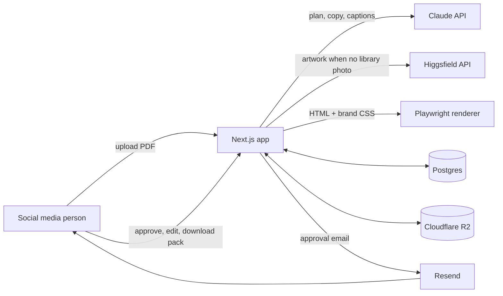
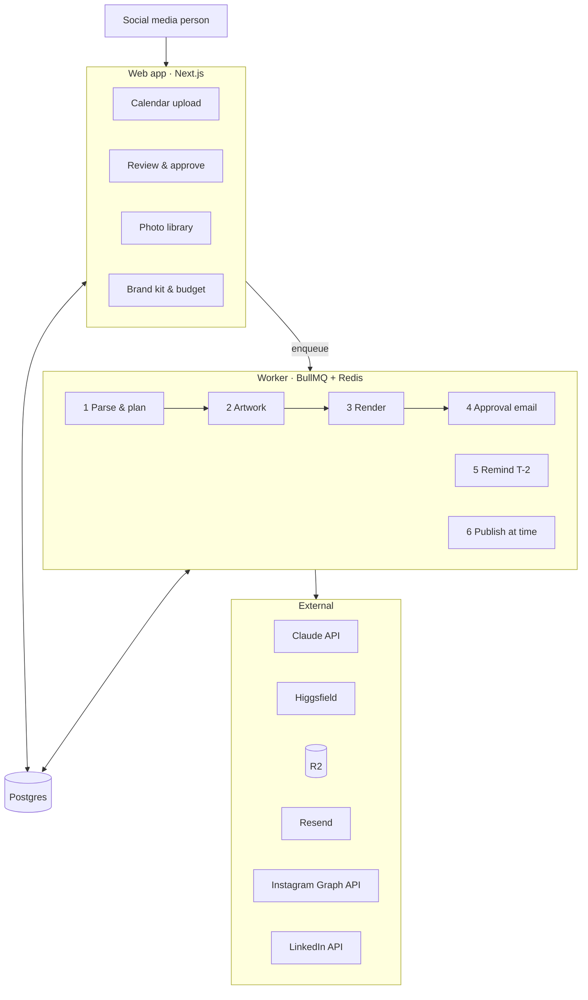

# Architecture

Principle: **AI writes the words and paints the backgrounds; code places text, logos and the footer.** The renderer uses `brand/tokens.css` + `brand/templates.css`, so the brand kit's previews are exactly what gets posted.

## SLC architecture (now)

One Next.js app in `web/`, no queue. Long work (planning, generating, rendering) runs in the background after the request returns (`after()` from `next/server`), writing progress to a `status` column the page polls.



### Month flow

> Since ADR-015 the month is built in the app: **New month → calendar entries (grid + "Add post" panel, suggested days) → Plan posts**. Steps 1–2 below now read entries instead of a PDF; "Import from PDF" (`POST /api/months/[id]/import`, purpose `import_pdf`) turns a PDF into entries first; suggested days come from `web/src/data/suggestedDays.ts` (`POST /api/months/[id]/suggestions`). Table `calendar_entries` (see TASKS T-04b) feeds `posts.entry_id`.

1. `POST /api/months` — month only → row in `months` (status `draft`). Entries are added with `POST /api/months/[id]/entries` (checked by `schemas/entries.ts`).
2. `POST /api/months/[id]/plan` → plan job (status `planning`): entries sent to Claude as JSON; Claude returns only the words per entry (`planAnswerShape`, structured output); `resolvePlan` adds the facts from the entries by code; limit checks (+ one post-only fix call); `savePlan` writes `posts` (with `entry_id`) and `slides`.
3. Picture job (per slide) — tags → `assets` search. Hit: link it. Miss: Higgsfield, N variants in parallel (idempotency key `slideId:variant`), each result copied to R2 at once (Higgsfield keeps outputs only ~7 days), logged in `generations` with cost. Budget check before every call.
4. Render job (`lib/render/renderPost.ts`, mapping in `fromDb.ts`; runs at the end of the plan job and again for one post when an image is filled) — for each slide: React template → HTML string (inlining tokens.css + templates.css + fonts) → Playwright screenshot of `.dp-post` → JPEG to R2.
5. Email — Resend, thumbnails + review link. Month status `in_review`.
6. Review page actions → re-plan one post (Claude), re-generate artwork, swap variant, edit text → re-render that post only.
7. Pack — zip streamed from R2: `YYYY-MM-DD_<post-id>/slide-01.jpg…`, `captions.md`, `schedule.csv`.

### Post lifecycle

`draft → rendering → rendered → approved` with `changes_requested` looping back to `rendering`. (Phase 2 adds `scheduled → published | failed`.)

## Data model (Drizzle)

| Table | Key fields |
| --- | --- |
| `months` | id, month (YYYY-MM), calendar_url (only for the later PDF import), status (draft / planning / planned / failed), reviewer_email, created_at |
| `calendar_entries` | id, month_id, date, kind, title, details (json: exhibition first/last day, city, stand; carousel fruit, points, slideCount), notes, aspect, time, platforms[], required_image_asset_id, source (manual / suggested / pdf_import) |
| `posts` | id, month_id, entry_id, date, time, kind (festival / exhibition / informative / day_of / bts), template, fruit (pomegranate / mango / grape / citrus / none), aspect (4:5 / 1:1), platforms[], caption_instagram, caption_linkedin, rationale, status |
| `slides` | id, post_id, idx, template_variant (cover / inner / cta / single), eyebrow, hero, sub, info, body, details (json), checklist (json), photo_tags[], artwork_prompt, asset_id, render_url |
| `assets` | id, url, kind (photo / cutout / event_logo / illustration / ai), tags[], description, people_ok, source (upload / higgsfield), created_at |
| `generations` | id, slide_id, request_id, model, prompt, variant, status, cost_usd, asset_id, created_at |
| `reviews` | id, post_id, action (approve / request_changes / edit), note, created_at |

Budget = (sum of `ai_calls.cost_usd` + `generations.cost_usd`) this calendar month × `USD_INR_RATE` vs `MONTHLY_AI_BUDGET_INR`. `ai_calls` logs every Claude call: purpose, model, tokens (incl. cache), cost, latency, status (ADR-013).

## Code layout (target)

```
web/src/
  app/                 pages: /, /months/[id], /library, /login; api routes
  lib/claude.ts        planMonth(), rewritePost()
  lib/higgsfield.ts    generateArtwork(prompt, n) → R2 assets, cost logged
  lib/budget.ts        canSpend(), spentThisMonth()
  lib/r2.ts            put/get/publicUrl
  lib/render/          templates (React) + renderSlide() via Playwright
  lib/email.ts         sendApprovalEmail()
  lib/pack.ts          buildMonthPack()
  db/schema.ts         Drizzle schema
  schemas/plan.ts      zod MonthPlan (shared by Claude tool + DB insert)
```

## Ideal architecture (end state)



Additions over the SLC: separate worker process with retries, delayed publish jobs, T-2 reminders for unapproved posts, users + roles (magic link), in-app brand kit editor (versioned `brand_kit` table), Instagram + LinkedIn publishing, insights.

## Roadmap

| Phase | Adds | Gate to start |
| --- | --- | --- |
| SLC | Upload → plan → library/Higgsfield artwork → render → email → review → pack | — |
| 2 · Instagram | BullMQ worker, delayed publish, IG posts + carousels via R2 public URLs, T-2 reminders, failure alerts | October posted from SLC; Meta Business access granted |
| 3 · Team-ready | Magic-link users and roles, brand kit editor, post history, LinkedIn posting | LinkedIn Community Management API access approved |
| 4 · Learn | Pull Instagram insights, rank templates/fruits, feed into planning | 2+ months of posts live |

## Deploy

Docker image based on the Playwright image (Chromium included), deployed to Fly.io with ≥ 1 GB RAM. Secrets via `fly secrets set`. Phase 2 adds a `worker` process group and Upstash/Fly Redis.
